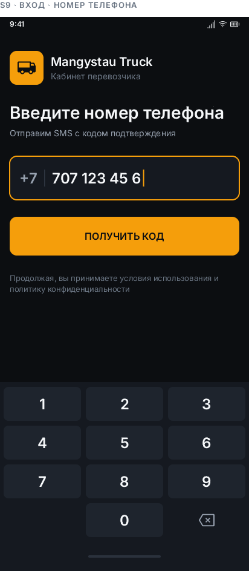
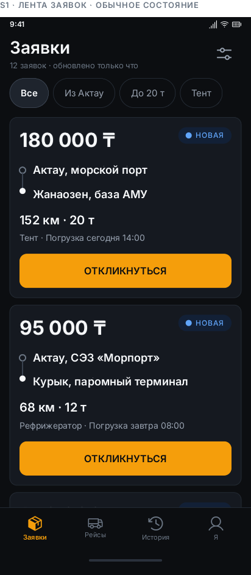
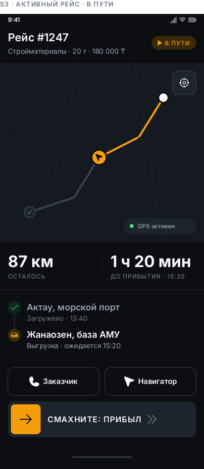
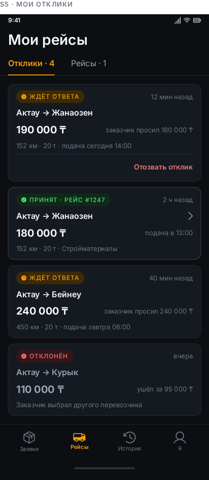

# Mangystau Truck — приложение водителя

Мобильный кабинет дальнобойщика платформы грузоперевозок Мангистау: биржа
заявок, отклики, ведение рейса с GPS-треком и заработок.

Роль `driver`. Кабинет заказчика (`shipper`) — веб, админка — MoonShine; эта
кодовая база их не касается.

- **API:** https://m-truck.atomozen.kz · [документация](https://m-truck.atomozen.kz/docs/api)
- **Дизайн:** канвас Brilliant `Driver` (16 экранов + страница токенов)
- **Платформы:** Android, iOS · Flutter 3.41 / Dart 3.11

## Скриншоты

| Вход по телефону | Лента заявок | Активный рейс | Мои рейсы |
|---|---|---|---|
|  |  |  |  |
| Свой цифровой пэд, маска `+7 707 123 45 67` | Биржа: цена крупно, маршрут, фильтры-чипы | Карта, «сколько осталось», свайп смены статуса | Отклики со статусами и назначенный рейс |

## Запуск

```bash
flutter pub get
flutter run
```

Боевой адрес API зашит по умолчанию. Для локального бэкенда:

```bash
flutter run --dart-define=API_BASE_URL=http://10.0.2.2:8000
```

Вход — по телефону, SMS не отправляются: **код подтверждения всегда `5555`**.
Новый водитель после входа заполняет анкету (права + машина) и ждёт одобрения
модератором; до этого биржа доступна только для просмотра.

Тестовый аккаунт (одобренный водитель, боевой API):

| Телефон | Код |
|---|---|
| `77010030212` | `5555` |

## Проверка

```bash
flutter analyze          # без замечаний
flutter test             # 108 тестов
flutter build apk --release
```

Golden-снимки лежат в `test/goldens/`. Пересобрать после правки вёрстки:

```bash
flutter test test/golden_test.dart --update-goldens
```

### Сборка на Windows

Инкрементальная компиляция Kotlin отключена в `android/gradle.properties`.
Причина: проект лежит на `D:`, а pub-кэш — на `C:`, и компилятор падает с
`this and base files have different roots`, пытаясь вычислить путь к исходникам
плагина относительно папки `android/`. Сборка при этом всё равно проходила, но
каждый раз через полную перекомпиляцию и с длинными стектрейсами в логе.

Если перенести кэш на диск проекта (`PUB_CACHE=D:\pub-cache` + `flutter pub get`),
строку `kotlin.incremental=false` можно убрать и вернуть инкрементальность.

### Релизная подпись

Релиз подписывается своим ключом, а не отладочным: приложение с debug-подписью
нельзя ни обновить поверх, ни загрузить в Play.

Ключ и пароли лежат вне репозитория — `android/key.properties` (в `.gitignore`)
указывает на keystore: `storeFile`, `storePassword`, `keyAlias`, `keyPassword`.
Без этого файла сборка молча падает обратно на debug-ключ, чтобы
`flutter run --release` работал у любого, кто клонировал проект.

Создать ключ заново (пароль хранить в менеджере паролей — потеря ключа означает
невозможность выпустить обновление):

```bash
keytool -genkeypair -v -keystore <путь>/upload.jks -storetype PKCS12   -keyalg RSA -keysize 2048 -validity 10000 -alias upload
```

```bash
flutter build apk --release              # один APK на все ABI, ~55 МБ
flutter build apk --release --split-per-abi   # по APK на архитектуру, ~20 МБ
flutter build appbundle --release        # .aab для Google Play
```

Проверить, каким ключом подписан результат:

```bash
apksigner verify --print-certs -v build/app/outputs/flutter-apk/app-release.apk
```

Перед публикацией в Play остаётся сменить `applicationId` с `com.example.m_truck`
на реальный и поднять `version` в `pubspec.yaml`.

## Экраны

| Экран | Файл | Что делает |
|---|---|---|
| Вход по телефону | `features/auth/phone_screen.dart` | Свой цифровой пэд, маска `+7 707 123 45 67` |
| Код из SMS | `features/auth/code_screen.dart` | Четыре ячейки, вход на последней цифре, отсчёт до повтора |
| Анкета водителя | `features/auth/register_driver_screen.dart` | Права, госномер, тип кузова, тоннаж |
| Ожидание модерации | `features/auth/moderation_screen.dart` | Статус проверки документов |
| Лента заявок | `features/marketplace/feed_screen.dart` | Биржа, превью карты, фильтры-чипы, состояния «нет сети» и «пусто» |
| Заявки на карте | `features/marketplace/orders_map_screen.dart` | Все заявки метками с ценой, путь и дистанция выбранной |
| Карточка заявки | `features/marketplace/order_screen.dart` | Карта маршрута, условия, заказчик, отклик |
| Лист отклика | `features/marketplace/bid_sheet.dart` | Своя цена с пресетами, время подачи |
| Мои рейсы | `features/trips/trips_screen.dart` | Отклики и назначенные рейсы |
| Активный рейс | `features/trips/active_trip_screen.dart` | Карта, «сколько осталось», свайп смены статуса |
| Завершение рейса | `features/trips/finish_trip_screen.dart` | Заработок, фото документов, сдача груза |
| Рейс завершён | `features/trips/trip_done_screen.dart` | Итог и предложение обратной загрузки |
| Обратная загрузка | `features/backload/backload_screen.dart` | Заявки из точки выгрузки |
| История и заработок | `features/history/history_screen.dart` | День/неделя/месяц, пробег, средний чек |
| Выплаты | `features/payouts/payouts_screen.dart` | Получено и в ожидании, фильтр по статусу, список рейсов |
| Профиль и машина | `features/profile/profile_screen.dart` | Документы, машина, очередь отправки, выход |

## Устройство кода

```
lib/
  core/          токены дизайна, тема, форматирование чисел и дат
  data/          API-клиент, модели, репозитории, локальные хранилища
  services/      связь, GPS, синхронизация офлайн-очереди
  state/         ChangeNotifier-контроллеры (сессия, лента, рейсы)
  features/      экраны по разделам
  widgets/       общие элементы: логотип, карточка заявки, бейджи, карты, свайп
```

Зависимости идут в одну сторону: `features` → `state` → `data`/`services` →
`core`. Граф собирается один раз в `main.dart` и раздаётся через `provider`.

### Бренд

Логотип — `assets/brand/logo.png`: квадрат 1892×1892 с непрозрачной подложкой
`#151920`, то есть ровно `AppColors.bgSurface`. Поэтому `AppLogo`
(`widgets/brand.dart`) рисует его плиткой со скруглением карточки — он читается
как элемент системы, а не как чужой прямоугольник поверх фона.

Вокруг марки в исходнике широкие пустые поля, из-за которых на плитке 64 dp она
выглядела бы крошечной. Срезаем их зумом `Transform.scale(1.25)`: подложка
совпадает с фоном плитки, шва не видно.

`BrandHeader` — шапка входа: плитка слева, название и роль справа. Логотип стоит
на сплэше и на экране входа. Иконка запуска приложения пока стандартная —
исходник для неё подходит, генерацию можно включить отдельно.

### Формат ответов

Все ответы обёрнуты конвертом `{success, data, message, meta?}`. `ApiClient`
снимает конверт, подставляет Bearer-токен и превращает сбои в `ApiException`:

- `isNetwork` — запрос не дошёл до сервера, действие можно отложить;
- `fieldErrors` — ошибки валидации по полям (422);
- 401 закрывает сессию через колбэк `onUnauthorized`.

Разбор моделей намеренно снисходительный: сервер отдаёт пустой объект `{}`
вместо `null` для незаполненных связей, а числа приходят то числом, то строкой.

### Работа без сети

Между Актау и Бейнеу связь пропадает надолго, поэтому офлайн — штатный режим,
а не ошибка.

- **Чтение.** Лента, активный рейс, отклики и история кэшируются на диск
  (`CacheStore`) вместе с отметкой времени. Без сети экран рисует сохранённые
  данные и честно пишет, когда они получены.
- **Запись.** Отклик, смена статуса рейса, подтверждение доставки и пачки
  GPS-точек уходят в персистентную очередь `Outbox`. `SyncService` разбирает её
  по одному элементу, сохраняя порядок, и останавливается на первом сетевом
  сбое. Отказ сервера (403, 409, 422) считается окончательным — такое действие
  не повторяется бесконечно.
- **Интерфейс.** Свайп смены статуса срабатывает сразу и локально; водитель
  видит результат, а плашка объясняет, что статус уйдёт при появлении связи.
- **Статус переживает перезапуск.** Локальный сдвиг статуса не только меняет
  состояние в памяти, но и патчит кэш активного рейса
  (`ShipmentRepository.cacheLocalStatus`). Иначе водитель, смахнувший
  «загрузился» в степи и закрывший приложение, увидел бы прежний шаг рейса.
  Ответ сервера накладывается на кэш, а не заменяет его целиком: урезанный ответ
  не должен стирать адреса и цену. Завершённый рейс убирается из кэша явно
  (`forgetCurrent`), иначе он воскресал бы при следующем запуске.

### Карта

Карта (`widgets/route_map.dart`) — тайлы OpenStreetMap через `flutter_map`,
затемнённые под тему приложения. Камера подгоняется по ломаной из GeoJSON так,
чтобы точки А и Б были в кадре целиком; на активном рейсе пройденный участок
подсвечен янтарным, а машина едет по ломаной.

Встроенная в экран карта не перехватывает жесты — иначе она съедала бы прокрутку
списка. Тап открывает её на весь экран (`RouteMapScreen`), там работают
перетаскивание и щипок, а под картой — адреса А и Б.

Тайлы кэшируются на диск средствами `flutter_map`, поэтому однажды показанный
участок трассы откроется и без сети. Пока тайл не пришёл, сквозь него видна
фоновая сетка, а маршрут и метки рисуются в любом случае — карта без связи
остаётся читаемой. За пошаговой навигацией водитель уходит во внешний навигатор
кнопкой «Навигатор» (`geo:` → Google Maps как запасной вариант).

> Публичные тайл-серверы OSM живут по [Tile Usage Policy][osm-tiles] и не
> рассчитаны на нагрузку продакшена. Перед раскаткой на парк машин тайлы стоит
> перевести на свой прокси или платного провайдера — меняется одна константа
> `_tileUrl`.

[osm-tiles]: https://operations.osmfoundation.org/policies/tiles

Общая основа обеих карт — `widgets/map_base.dart`: тайлы, фон-сетка, подпись
источника, синяя точка «я здесь» и кнопка местоположения. Карта не ходит в GPS
сама — экран передаёт ей готовую функцию `MapLocator`, поэтому виджет остаётся
без зависимости от служб и легко проверяется в тестах.

`widgets/orders_map.dart` — карта заявок. Метка показывает цену: по ней и
выбирают. Тап рисует путь выбранной заявки и точку выгрузки; остальные заявки
остаются точками погрузки, иначе меток вдвое больше и ни одна ничего не значит.
Над лентой стоит превью той же карты — без жестов, чтобы не съедать прокрутку;
тап и кнопка «НА КАРТЕ» разворачивают её на весь экран.

Пошаговый маршрут строит навигатор водителя. `widgets/navigator_sheet.dart`
спрашивает какой — 2ГИС, Яндекс Навигатор или Google Карты — и открывает точку
приложением, а если оно не установлено, то веб-версией. 2ГИС и Яндекс ждут
координаты в порядке «долгота, широта» — на этом легко ошибиться.

### Выплаты

`GET /api/my/payouts` отдаёт список доставленных заказов с суммами и сводку
`paid_total / pending_total / paid_count / pending_count`. Сводка на сервере
считается по всем выплатам, поэтому цифры вверху экрана не прыгают при
переключении фильтра.

Экран (`features/payouts/`) открывается из «Истории» и из «Я» строкой
`PayoutsEntryRow`, которая сразу показывает ожидаемую сумму. Внутри — две
крупные цифры «получено / в ожидании», фильтр «Все · Ожидают · Выплачены» и
список рейсов с бейджем статуса.

Офлайн работает как везде: полная выдача кэшируется, фильтр по кэшу применяется
на клиенте, обрезанная выдача кэш не перетирает.

### Шаги сделки

Один бейдж статуса отвечает на вопрос «что сейчас», но не на вопрос «сколько
ещё». `widgets/step_trail.dart` показывает весь путь целиком — Отклик · Принят ·
Погрузка · В пути · Сдан — и отправленный отклик перестаёт выглядеть застрявшим.
Полоса стоит в карточке отклика, в карточке рейса и на заявке после отклика.

Принятый отклик из вкладки «Отклики» уходит: он уже стал рейсом, и держать его
в двух местах значит показывать одну работу дважды (`TripController.openBids`).

`GET /api/my/bids` отдаёт отклик **без вложенной заявки**, поэтому в списке
нечем показать «Актау → Жанаозен». `MarketplaceRepository` дотягивает заявки
сам: сначала из кэша ленты — она там почти всегда есть, ведь отклик оттуда и
сделан, — и только за остальными идёт в сеть.

### Чего приложение не умеет

Мобильное API платформы состоит из чтения и действий по рейсу. Методов записи
в профиль, машину, документы и реквизиты в нём нет, поэтому соответствующие
пункты в «Я» стоят на своих местах **закрытыми** (`widgets/locked_row.dart`):
по тапу каждый честно объясняет, что не работает и к кому идти. Так видно, что
функция задумана, и никто не ищет несуществующую кнопку.

Закрыты: данные профиля, фото пользователя, смена роли, тип транспорта,
документы, банковская карта, уведомления, язык. Чтобы открыть, бэкенду нужны
эндпоинты на обновление `User`, `Vehicle`, документов водителя и на приём
платёжных реквизитов.

### GPS

Трекинг включается, пока рейс в работе, и пишет точку не чаще одной на 50 м.
Точки копятся пачками по 10 (или раз в 2 минуты) и уходят в `/api/tracking/batch`
до 200 за запрос. Без сети — в очередь; счётчик буфера виден на карте.

## Задействованные эндпойнты

| Метод | Путь | Где используется |
|---|---|---|
| POST | `/api/auth/phone/check` | Запрос кода |
| POST | `/api/auth/phone/verify` | Вход, выдача токена |
| POST | `/api/auth/register-driver` | Анкета водителя (multipart) |
| GET | `/api/auth/me` | Восстановление сессии, проверка модерации |
| POST | `/api/auth/logout` | Выход |
| GET | `/api/marketplace/orders` | Лента биржи, поиск обратной загрузки |
| GET | `/api/marketplace/orders/{order}` | Карточка заявки |
| POST | `/api/orders/{order}/bids` | Отклик |
| GET | `/api/my/bids` | Мои отклики |
| GET | `/api/driver/current-shipment` | Активный рейс |
| GET | `/api/my/shipments` | Рейсы и история |
| POST | `/api/shipments/{shipment}/status` | Смена статуса рейса |
| POST | `/api/shipments/{shipment}/proof` | Подтверждение доставки (multipart) |
| POST | `/api/tracking/batch` | Пачка GPS-точек |
| GET | `/api/my/payouts` | Экран «Выплаты»: список и сводка |

Не используются: `/api/orders*` для заказчика, `/api/geo/*`, `/api/settlements`,
`/api/routing/route`, `/api/shipments/{shipment}/track`, `/api/public/track/{token}`
— это контур веб-кабинета заказчика и публичного трекинга.

`/api/device-token` не подключён: push-уведомлений в сборке нет, для них нужен
Firebase-проект. Места, где приложение обещает уведомление, честно опираются на
периодическое обновление списков.

## Разрешения

| Разрешение | Зачем |
|---|---|
| Интернет, состояние сети | Биржа и определение офлайна |
| Геолокация | Трек рейса, фильтр «Рядом», координаты при смене статуса |
| Камера | Фото прав и накладной |
| Вибрация | Тактильный отклик свайпа и клавиатуры |

## Дизайн

Тёмная тема — основная, а не опция: ночные рейсы, засветка солнцем, экономия
батареи. Один акцент — янтарный `#F59E0B`. Иерархия строится размером и
пространством, теней нет — глубина передаётся уровнями поверхности.

Токены собраны в `core/theme/tokens.dart` и повторяют страницу «Design Tokens»
из Brilliant. Ключевые правила:

- **Табулярные цифры** на ценах, километрах, тоннах и времени — цифры не прыгают
  при обновлении.
- **Неразрывные пробелы** между числом и единицей: «180 000 ₸» не переносится.
- **Зоны нажатия** — минимум 56 dp, CTA 64, свайп 72: водитель в перчатке,
  кабина трясётся.
- **Статус = цвет + иконка + текст.** Экран засвечен, водитель может быть
  дальтоником — одного цвета недостаточно.
